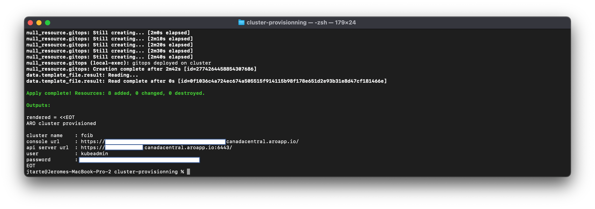

# Deploy Azure Red Hat OpenShift (ARO) using a terraform script

This repository contains a terraform script (and its supporting scripts) to deploy an Azure Red Hat OpenShift (ARO) on Azure.

## Prepare 

First, clone the repository on your environment.

```
git clone git@github.com:jtarte/terraform_azure_aro.git
```

Move inside the terraform script directory,named `cluster-provisoning`.
```
cd terraform_azure_aro/cluster-provisioning
```

Create a `terraform.tfvars` using the template `terraform.tfvars.sample`
```
cp terraform.tfvars.sample terraform.tfvars
```

Edit the file and fill it with the appropriate variables and values.

## Variables

variable name | description | status | default value
------------- | --------------------- | --- | ---
subscription_id | The subscription id of the used Azure account |  | 
subscription_tenant_id | The subscription tenant id of the used Azure account |  | 
region | Azure region used for deployment. | optional | canadacentral
resource_group| The resource used for the ARO cluster deployment | required |
cluster_name | The name of the cluster | required  |
vnet | The vnet used for ARO cluster deployment |  required |
master_subnet| The subnet hosting the master nodes | required |
worker_subnet| The subnet hosting the worker nodes | required | 
worker_count | The number of worker nodes to be provisioned | optional | 3 
worker_flavor | The vm flavor for worker nodes |  optional | Standard_D8s_v3
master_flavor | The vm flavor for master nodes |  optional | Standard_D8s_v3
apiserver-visibility | Define what is the visibility of aro cluster api | optional | Public
ingress-visibility | Define what is the visibility of aro ingress | optional | Public

## Init 

Before to launch the terraform script, you should be authenticated on Azure with the az cli.
```
az login
```

You should initialize the terraform environment.
```
terraform init
```

Then, you could plan the execution 
```
terraform plan
```

## Launch the cluster provisoning 

To launch the ARO cluster provisoning, use the following command:
```
terraform apply
```

NB: the process takes around 35-40 min to provision a cluster. 

Once the process is finished, you could a message with information you need to connect to the cluster. 


## Destroy the cluster

To destroy the cluster, use the following command:
```
terraform destroy
```

## Troubleshooting

The terraform process could exit without having fully executed the process. during my tests, I got two cases

* state `null_resource.oc-login` . The oc login operation doesn't succeed.
* state `null_resource.gitops`. The deployment of gitops feature doesn't succeed.

In both case, delete the state:
```
terraform state rm <the name of the state>
```

Then, re-run the terraform script.
```
terraform apply
```
It will execute the script again but only starting from the state that was removed. 
